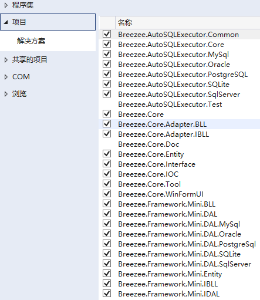

# 工作助手（WorkHelper）

## 介绍
【工作助手】是一款基于个人开发的迷你式框架（只有简单的用户登录，没有角色授权、组织管理等）的工具软件，主要针对软件开发和设计、数据库开发与运维、测试人员等使用，
用于生成数据库变更脚本等相关操作。当然，也包括一些常用的字符拼接、复制等功能，适用于任何使用电脑的人员！！

## 软件架构
使用基于.Net Framework 4.8的C# + WinForm 开发，支持SqlServer、Oracle、MySql、SQLite、PostgreSql五种数据库类型。因为是工具类，默认使用简单易用的SQLite数据库。
本软件基于个人的MiniWinFormApp框架，实现模块化，目前只有一个数据库工具子模块。项目也使用了一些开源框架，如IOC使用Castle.Windsor，Excel导入导出使用NPOI。
UI组件一般就是使用微软自带的。本项目也集成了个人另外两个项目【MyPeachNet】、【AutoSQLExcutor】在.Net Framework4.8下的实现。

## 开发调试
* 1.下截源码后，设置【Breezee.Framework.Mini.StartUp】为启动项目，并保证该项目引用了以下项目： 
  
## 下载使用
* 1.打开发布包链接，下载软件：  
    [发布包下载](https://gitee.com/breezee2000/WorkHelper/releases)  
* 2.下载完成并解压后，双击【Breezee.Framework.Mini.StartUp.exe】打开程序。
  注：1.02及其之前使用安装包形式，需要安装；1.0.3之后，使用绿色包方式，即解压即可使用。
* 3.默认的用户是xtadmin，密码是1。登录进去后，我们也可以修改。  
* 4.每个功能都有操作说明。我们可以点击工具栏上的【问号书】或【帮助】菜单下的【用户手册】查看。  

